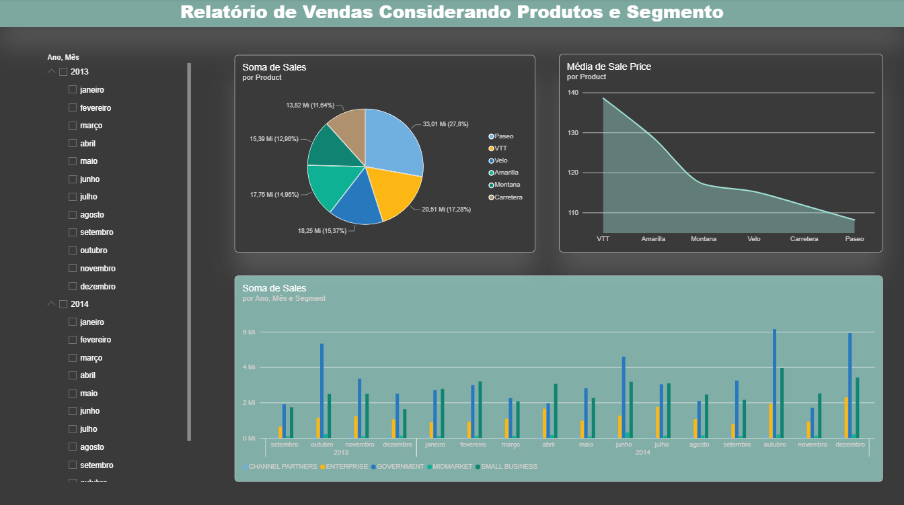
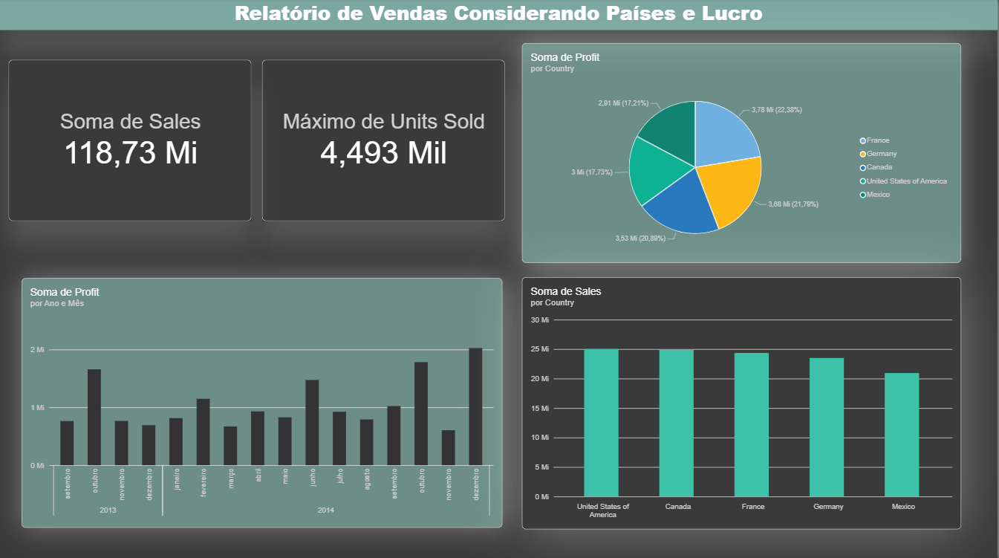
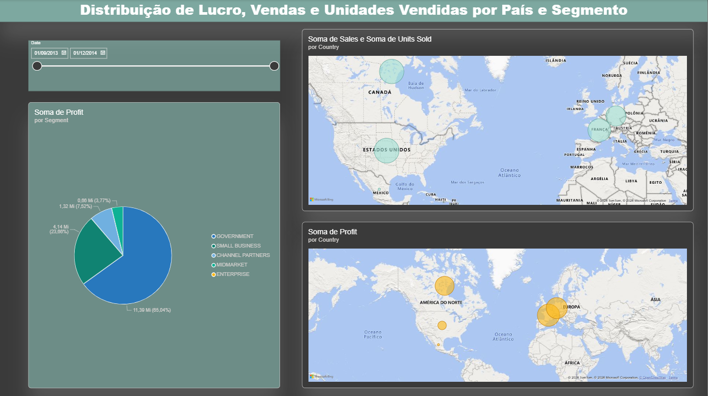

# 📊 Power BI — Financial Sample Dashboard

> Dashboard analítico desenvolvido no **Power BI Desktop** com base na *Financial Sample* disponibilizada pela Microsoft, replicando e expandindo as páginas criadas durante o curso de Power BI Analyst da DIO.

**Ferramenta:** Power BI Desktop · **Dataset:** Financial Sample (Microsoft) · **Período:** 2013–2014

🔗 **Repositório de referência:** [julianazanelatto/power_bi_analyst](https://github.com/julianazanelatto/power_bi_analyst)

---

## 📑 Índice

1. [Contexto e Objetivos](#1--contexto-e-objetivos)
2. [Dataset](#2--dataset)
3. [Páginas do Dashboard](#3--páginas-do-dashboard)
4. [Decisões técnicas e boas práticas](#4--decisões-técnicas-e-boas-práticas)
5. [Como abrir o projeto](#5--como-abrir-o-projeto)

---

## 1 · Contexto e Objetivos

Este projeto foi desenvolvido como entrega do desafio prático do módulo de **Power BI Analyst** da DIO. O objetivo foi replicar as duas primeiras páginas do relatório construídas durante o curso e, de forma autônoma, criar uma **terceira página inédita** com visuais de mapa e distribuição por segmento.

**Objetivos do projeto:**

- Replicar fielmente as páginas 1 e 2 do relatório do curso;
- Criar a página 3 de forma independente, seguindo as especificações do desafio;
- Aplicar boas práticas de nomenclatura de visuais e uso de dicas de ferramentas (*tooltips*);
- Verificar a disposição e hierarquia visual dos elementos no relatório;
- Publicar o relatório e compartilhar como suplemento.

---

## 2 · Dataset

| Campo | Detalhe |
|---|---|
| **Nome** | Financial Sample |
| **Fonte** | Microsoft / DIO — [Repositório da instrutora](https://github.com/julianazanelatto/power_bi_analyst) |
| **Período** | Setembro/2013 a Dezembro/2014 |
| **Países** | United States of America, Canada, France, Germany, Mexico |
| **Segmentos** | Government, Small Business, Channel Partners, Midmarket, Enterprise |
| **Produtos** | Paseo, VTT, Velo, Amarilla, Montana, Carretera |
| **Principais métricas** | Sales, Profit, Units Sold, Sale Price, COGS, Discounts |

---

## 3 · Páginas do Dashboard

### 📄 Página 1 — Relatório de Vendas Considerando Produtos e Segmento



**Visuais presentes:**

| Visual | Tipo | Campos |
|---|---|---|
| Soma de Sales por Product | Gráfico de pizza | Product, Sales |
| Média de Sale Price por Product | Gráfico de área | Product, Sale Price |
| Soma de Sales por Ano, Mês e Segment | Gráfico de barras agrupadas | Date (Ano/Mês), Segment, Sales |
| Filtro de período | Segmentação (slicer) | Date (Ano, Mês) |

**Destaques:** O gráfico de pizza revela que **Paseo** lidera com 27,8% das vendas totais. O gráfico de barras permite análise temporal por segmento, evidenciando picos em outubro/2013 e novembro–dezembro/2014.

---

### 📄 Página 2 — Relatório de Vendas Considerando Países e Lucro



**Visuais presentes:**

| Visual | Tipo | Campos |
|---|---|---|
| Soma de Sales (KPI) | Cartão | Sales |
| Máximo de Units Sold (KPI) | Cartão | Units Sold |
| Soma de Profit por Country | Gráfico de pizza | Country, Profit |
| Soma de Profit por Ano e Mês | Gráfico de barras | Date (Ano/Mês), Profit |
| Soma de Sales por Country | Gráfico de barras | Country, Sales |

**Destaques:** Total de vendas de **US$ 118,73 milhões** com máximo de **4.493 mil unidades** vendidas. France lidera em profit (22,38%), enquanto USA lidera em volume de sales.

---

### 📄 Página 3 — Distribuição de Lucro, Vendas e Unidades Vendidas por País e Segmento ⭐



> Página criada de forma independente como entrega do desafio.

**Visuais presentes:**

| Visual | Tipo | Campos | Dica de ferramenta |
|---|---|---|---|
| Soma de Sales e Units Sold por Country | Mapa (bolhas) | Country, Sales, Units Sold | Units Sold |
| Soma de Profit por Country | Mapa (bolhas) | Country, Profit | Profit |
| Soma de Profit por Segment | Gráfico de pizza | Segment, Profit | — |
| Filtro de período | Segmentação de data (slider) | Date |  — |

**Destaques da página 3:**
- O mapa superior mostra concentração de vendas em **USA e Canada** (América do Norte) e **France** (Europa);
- O mapa de profit revela que **Europa** (France + Germany) concentra o maior lucro agregado;
- O gráfico de pizza evidencia que o segmento **Government domina com 65% do lucro total**;
- O filtro de data permite recorte temporal interativo entre os dois mapas e a pizza simultaneamente.

---

## 4 · Decisões técnicas e boas práticas

### Nomenclatura de visuais
Todos os títulos foram renomeados para descrever claramente o que o visual representa, substituindo os nomes automáticos gerados pelo Power BI (ex.: *"Sum of Sales"* → *"Soma de Sales por Country"*).

### Dicas de ferramentas (tooltips)
Campos complementares foram adicionados como *tooltips* nos visuais de mapa, permitindo que o usuário visualize métricas adicionais ao passar o cursor sobre cada país sem poluir o visual principal.

### Disposição dos visuais
- KPIs de destaque posicionados no canto superior esquerdo (Página 2) para leitura imediata;
- Mapas ocupam a metade direita da Página 3, priorizando a análise geográfica;
- Filtros (slicers) posicionados à esquerda em todas as páginas para consistência de layout.

### Paleta de cores
Mantida a paleta do tema do curso (tons de verde-água/teal e dark background) para consistência visual entre as três páginas.

---

## 5 · Como abrir o projeto

### Pré-requisitos
- [Power BI Desktop](https://powerbi.microsoft.com/pt-br/desktop/) instalado (gratuito)

### Passo a passo

1. Clone ou baixe este repositório:
   ```bash
   git clone https://github.com/antoniolpagnano/power-bi-financial-sample-dashboard
   ```

2. Abra o arquivo do projeto:
   ```
   Dash-Financials.pbix
   ```

3. O dataset já está embutido no `.pbix` — nenhuma conexão externa é necessária.

---

## 📌 Sobre este projeto

Projeto desenvolvido como parte do **Bootcamp de Power BI Analyst** da [DIO](https://www.dio.me/), com base no material da instrutora [Juliana Zanelatto](https://github.com/julianazanelatto/power_bi_analyst).

**Tags:** `#PowerBI` `#DataVisualization` `#FinancialAnalysis` `#DIO` `#BusinessIntelligence` `#Dashboard`
